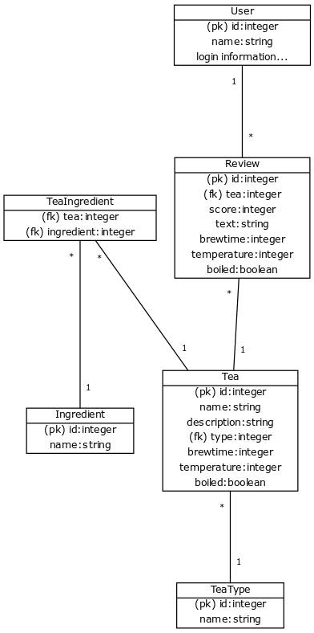

### käsitteet
- Käyttäjä
- Teelaji
- Ainesosa
- Teetyyppi
- Arvostelu

- Ainesosiin lukeutuu puhtaat teet ja teessä käytettävät mausteet
### attribuutit
- Käyttäjä
  - nimi
- Teelaji
  - tyyppi fk-> teetyyppi
  - nimi
  - kuvaus
  - alustava haudutusaika
  - alustava haudutuslämpötila
  - keitetäänkö vesi
- Ainesosa
  - nimi
- Teetyyppi
  - nimi
- Arvostelu
  - käyttäjä fk-> Käyttäjä
  - tee fk-> Teelaji
  - arvosana
  - teksti
  - haudutusaika
  - haudutuslämpötila
  - onko vesi keitetty
- Blend
  - blend fk-> Teelaji
  - ainesosa fk-> Teelaji

### relaatiot
```
[Käyttäjä]--*[Arvostelu]
[Teelaji]*--*[Ainesosa]
[Teelaji]*--[Teetyyppi]
[Arvostelu]*--[Teelaji]
```

### tietokantakaavio
```
[Käyttäjä|(pk) id:integer;nimi:string;sisäänkirjautumistietoja...]
[Teelaji|(pk) id:integer;nimi:string;kuvaus:string;(fk) tyyppi:integer;onkoBlend:boolean;haudutusaika:integer;lämpötila:integer;keitetäänkö:boolean]
[Teetyyppi|(pk) id:integer;nimi:string]
[Ainesosa|(pk) id:integer;nimi:string]
[Arvostelu|(pk) id:integer;(fk) tee:integer;arvosana:integer;teksti:string;haudutusaika:integer;lämpötila:integer;keitetty:boolean]
[TeeAinesosa|(fk) tee:integer; (fk) ainesosa:integer]

[Käyttäjä]1--*[Arvostelu]
[Teelaji]*--1[Teetyyppi]
[Arvostelu]*--1[Teelaji]
[TeeAinesosa]*--1[Teelaji]
[TeeAinesosa]*--1[Ainesosa]
```

- Tallennetaan tietokanta sovelluksessa englanniksi.

```
[User|(pk) id:integer;name:string;login information...]
[Tea|(pk) id:integer;name:string;description:string;(fk) type:integer;brewtime:integer;temperature:integer;boiled:boolean]
[TeaType|(pk) id:integer;name:string]
[Ingredient|(pk) id:integer;name:string]
[Review|(pk) id:integer;(fk) tea:integer;score:integer;text:string;brewtime:integer;temperature:integer;boiled:boolean]
[TeaIngredient|(fk) tea:integer; (fk) ingredient:integer]

[User]1--*[Review]
[Review]*--1[Tea]
[TeaIngredient]*--1[Tea]
[Tea]*--1[TeaType]
[TeaIngredient]*--1[Ingredient]
```


