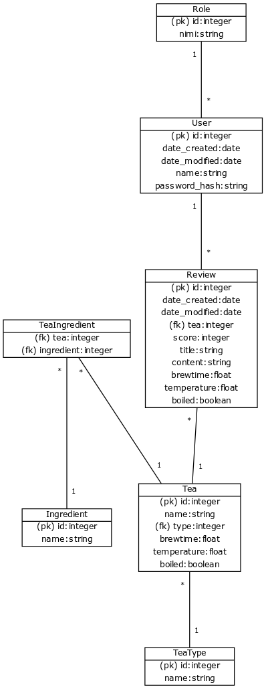

### käsitteet
- Käyttäjä
- Rooli
- Teelaji
- Ainesosa
- Teetyyppi
- Arvostelu

- Ainesosiin lukeutuu puhtaat teet ja teessä käytettävät mausteet
### attribuutit
- Käyttäjä
  - nimi
  - luontiaika
  - muokkausaika
- Rooli
  - nimi
- Teelaji
  - tyyppi fk-> teetyyppi
  - nimi
  - alustava haudutusaika
  - alustava haudutuslämpötila
  - keitetäänkö vesi
- Ainesosa
  - nimi
- Teetyyppi
  - nimi
- Arvostelu
  - käyttäjä fk-> Käyttäjä
  - tee fk-> Teelaji
  - arvosana
  - otsikko
  - teksti
  - luontiaika
  - muokkausaika
  - haudutusaika
  - haudutuslämpötila
  - onko vesi keitetty

### relaatiot
```
[Käyttäjä]--*[Arvostelu]
[Rooli]--*[Käyttäjä]
[Teelajike]*--*[Ainesosa]
[Teelajike]*--[Teetyyppi]
[Arvostelu]*--[Teelajike]
```

### tietokantakaavio
```
[Käyttäjä|(pk) id:integer;luontiaika:date;muokkausaika:date;nimi:string;salasanan hash]
[Rooli|(pk) id:integer;nimi:string]
[Teelajike|(pk) id:integer;nimi:string;(fk) tyyppi:integer;onkoBlend:boolean;haudutusaika:integer;lämpötila:integer;keitetäänkö:boolean]
[Teetyyppi|(pk) id:integer;nimi:string]
[Ainesosa|(pk) id:integer;nimi:string]
[Arvostelu|(pk) id:integer;luontiaika:date;muokkausaika:date;(fk) tee:integer;arvosana:integer;otsikko:string;teksti:string;haudutusaika:float;lämpötila:float;keitetty:boolean]
[TeeAinesosa|(fk) tee:integer; (fk) ainesosa:integer]

[Käyttäjä]1--*[Arvostelu]
[Rooli]1--*[Käyttäjä]
[Teelajike]*--1[Teetyyppi]
[Arvostelu]*--1[Teelajike]
[TeeAinesosa]*--1[Teelajike]
[TeeAinesosa]*--1[Ainesosa]
```

- Tallennetaan tietokanta sovelluksessa englanniksi.

```
[User|(pk) id:integer;date_created:date;date_modified:date;name:string;password_hash:string]
[Role|(pk) id:integer;nimi:string]
[Tea|(pk) id:integer;name:string;(fk) type:integer;brewtime:float;temperature:float;boiled:boolean]
[TeaType|(pk) id:integer;name:string]
[Ingredient|(pk) id:integer;name:string]
[Review|(pk) id:integer;date_created:date;date_modified:date;(fk) tea:integer;score:integer;title:string;content:string;brewtime:float;temperature:float;boiled:boolean]
[TeaIngredient|(fk) tea:integer; (fk) ingredient:integer]

[User]1--*[Review]
[Role]1--*[User]
[Review]*--1[Tea]
[Tea]*--1[TeaType]
[TeaIngredient]*--1[Tea]
[TeaIngredient]*--1[Ingredient]
```



Taulunluontikäskyt (nimi User on varattu):

```
CREATE TABLE role (
	id INTEGER NOT NULL, 
	name VARCHAR(144) NOT NULL, 
	PRIMARY KEY (id)
)
CREATE TABLE ingredient (
	id INTEGER NOT NULL, 
	name VARCHAR(256) NOT NULL, 
	PRIMARY KEY (id)
)
CREATE TABLE tea_type (
	id INTEGER NOT NULL, 
	name VARCHAR(256) NOT NULL, 
	PRIMARY KEY (id)
)
CREATE TABLE account (
	id INTEGER NOT NULL, 
	date_created DATETIME, 
	date_modified DATETIME, 
	name VARCHAR(144) NOT NULL, 
	username VARCHAR(144) NOT NULL, 
	password_hash VARCHAR(255), 
	role INTEGER, 
	PRIMARY KEY (id), 
	FOREIGN KEY(role) REFERENCES role (id)
)
CREATE TABLE tea (
	temperature FLOAT, 
	brewtime FLOAT, 
	boiled BOOLEAN, 
	id INTEGER NOT NULL, 
	name VARCHAR(256) NOT NULL, 
	type INTEGER, 
	PRIMARY KEY (id), 
	CHECK (boiled IN (0, 1)), 
	FOREIGN KEY(type) REFERENCES tea_type (id)
)
CREATE TABLE tea_ingredient (
	tea INTEGER NOT NULL, 
	ingredient INTEGER NOT NULL, 
	PRIMARY KEY (tea, ingredient), 
	FOREIGN KEY(tea) REFERENCES tea (id), 
	FOREIGN KEY(ingredient) REFERENCES ingredient (id)
)
CREATE TABLE review (
	temperature FLOAT, 
	brewtime FLOAT, 
	boiled BOOLEAN, 
	date_created DATETIME, 
	date_modified DATETIME, 
	id INTEGER NOT NULL, 
	user INTEGER, 
	title VARCHAR(256), 
	tea INTEGER, 
	score INTEGER, 
	content TEXT, 
	PRIMARY KEY (id), 
	CHECK (boiled IN (0, 1)), 
	FOREIGN KEY(user) REFERENCES account (id), 
	FOREIGN KEY(tea) REFERENCES tea (id)
)
```
